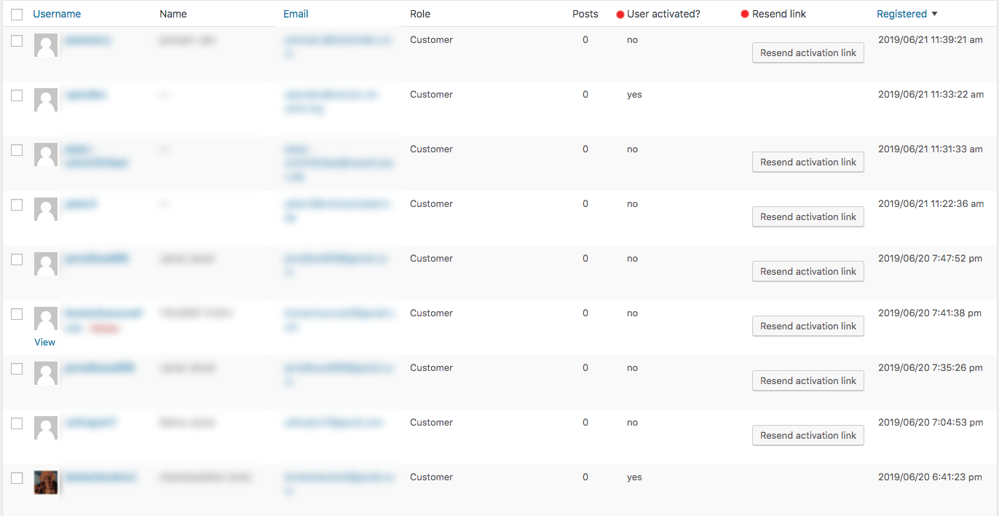

# Resend Activation Link for WooCommerce Germanized
> See directly in the users table which user is not activated and send the activation link with one click again

**Prerequisites:** Only works with WooCommerce Germanized

Tested with WooCommerce 3.6.4 and Germanized for WooCommerce 2.3.2

## Installation

Install into your wordpress wp-content/plugins folder. Don't forget to **activate the plugin** after installing.

## Usage example

Login into your wordpress admin panel. Go to Users and click on All Users. In the users table you will see two new columns. One
column has a button to resend activation email to the user.

## Release History

* 1.0.0
    * First release

## Meta

Your Name – [@NFpeter](https://twitter.com/NFpeter)

Distributed under the MIT license. See ``LICENSE`` for more information.

